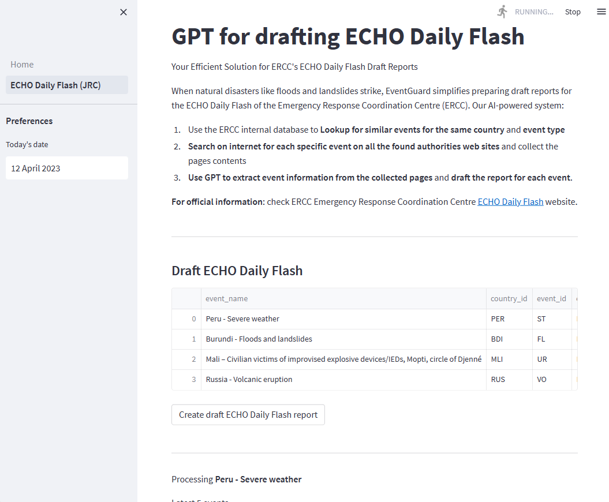

# app-echo-flash-daily
## Screenshot

 
## Prerequisites
1/ pip install required packages

2/ Update .streamlit/secrets.toml with your API keys

3/ add your event history the the data/event-history-dataset.csv file

## Getting started
1/ Open command prompt

2/ streamlit run Home.py

